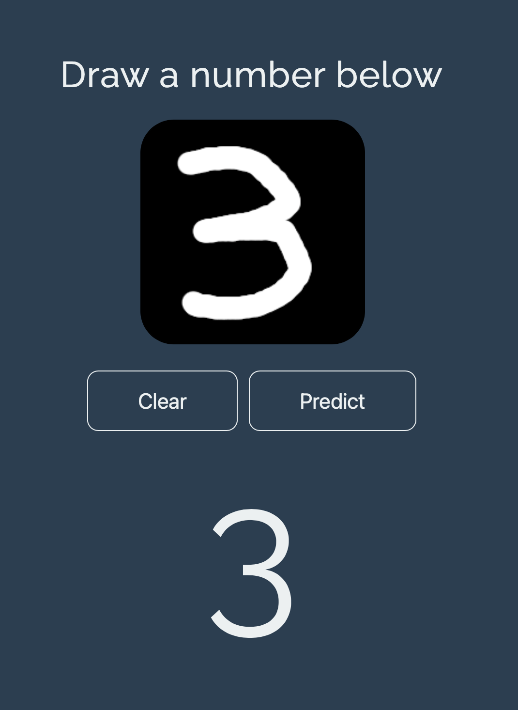

# Handwritten Number Recognition

This app classifies the number drawn on the screen into a digit.
A recurrent convolutional neural network was trained on the MNIST handwritten digit dataset with tensorflow in python. Model was imported in JavaScript with TensorFlow.js.
